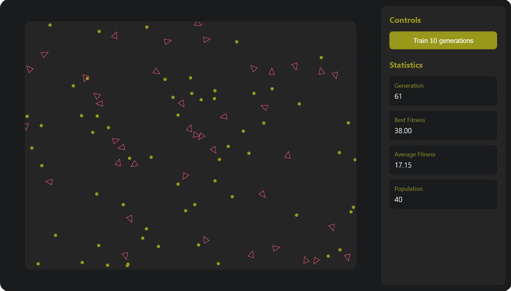

# 🦅 Evobird
A genetic evolution simulator using genetics algorithm and neural network written in Rust and compiler to WebAssembly

<div align="center">
<br>



<br>
</div>
<br>

## Getting Started

### Prerequisites
- [Rust](https://www.rust-lang.org/tools/install)
- [Node.js](https://nodejs.org/)
- [wasm-pack](https://rustwasm.github.io/wasm-pack/)

### Installation

1. Install wasm-pack:
```bash
cargo install wasm-pack
```
2. Clone the repository:
```bash
git clone https://github.com/Nishantdd/Evobird.git
cd Evobird
```
3. Build the WebAssembly module:
```bash
cd libs/simulation-wasm
wasm-pack build
```
4. Install dependencies for frontend
```bash
cd ../../www
npm install
```
5. Run the web application
```bash
npm run start
```
## 🔧 Development
The project will be served at http://localhost:8080. Any changes to the source code will trigger automatic rebuilding.